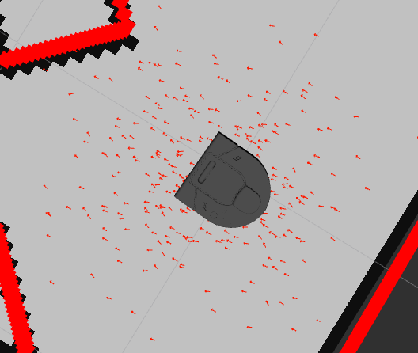

Writeup (Due 10-13)Permalink

In your ROS package create a README.md file to hold your project writeup. Your writeup should touch on the following topics. We expect this writeup to be done in such a way that you are proud to include it as part of your professional portfolio. As such, please make sure to write the report so that it is understandable to an external audience. Make sure to add pictures to your report, links to Youtube videos, embedded animated Gifs (these can be recorded with the tool peek).

    What was the goal of your project?
    How did you solve the problem? (Note: this doesn’t have to be super-detailed, you should try to explain what you did at a high-level so that others in the class could reasonably understand what you did).
    Describe a design decision you had to make when working on your project and what you ultimately did (and why)? These design decisions could be particular choices for how you implemented some part of an algorithm or perhaps a decision regarding which of two external packages to use in your project.
    What if any challenges did you face along the way?
    What would you do to improve your project if you had more time?
    Did you learn any interesting lessons for future robotic programming projects? These could relate to working on robotics projects in teams, working on more open-ended (and longer term) problems, or any other relevant topic.

ros2 launch neato2_gazebo neato_gauntlet_world.py
ros2 launch robot_localization launch_map_server.py map_yaml:=./gauntlet.yaml
RUN FROM robot_localization/maps

# Robot Localization

The goal of robot localization is to find a robot's position relative to a global map frame. For example, if you drop a robot randomly in a room and turn it on, how does the robot know where it is in the room? Or another example, if a robot knows where its starting position is and starts moving, how do we account for the error in the wheel/positional sensors to get a reliable position reading of the robot relative ot the room? Using a technique like a particle filter and laser scan data from a robot, we can find the robots location relative to a global frame without knowing where it started!

## How we solved the problem

In order to figure out where the robot actually is, we can't just interpret sensor data directly, because sensors have error and the world has uncertainty; therefore, sensor readings may not be an accurate indicator of where the robot is in space.

To solve this problem, we created a particle filter that localizes the robot in a 2D map of its environment.

A particle filter consists of a particle cloud. We created a particle cloud that consists of particles, or 2D vectors that represents a potential location of the robot. You could think of it as a hypothesis that indicates a potential place the robot could be. Each particle has an associated weight that reflects a confidence. The confidence indicates how probable it is that the particle is at the robot's true location. We then resample the particles and create a new cloud, with higher-weighted particles being more likely to be chosen. This creates an accurate filter that localizes the robot in 2D space.

### Particle Filter Steps

Our particle filter script adhered to this series of steps:

1. The particle cloud is initialized around a given pose. If no initial pose is provided, it uses odometry data to create a particle cloud around where the wheel encoders suggest the robot is in space.
2. As new encoder/odometry and laser scan data are received, the particles locations and weights are updated, making use of this new data. The odometry data is used to update the particle locations and the laser scan data is used to update the particle weights.
3. The particles are resampled according to their weights. Particles with higher weights are more likely to be resampled / are sampled more often. This is good because those particles are the most likely to represent the robots true state.
4. The robot's estimated pose is updated based on the best particle / the particle with the highest confidence.
5. Steps 2-4 repeat each time new odometry and laser scan data is recieved.

### How the particle filter works (more in-depth)

We use ROS 2 to handle sensor data retrieval and particle publishing.

#### Initialization

We create 3 normal distributions, each centered around the x, y, and theta values of the robots initial pose, respectively, and sampled from them to create the initial particle cloud. To generate the normal distributions we use numpy.random.normal:

```python
def initialize_particle_cloud(self, timestamp, xy_theta=None):
        """ Initialize the particle cloud.
            Arguments
            xy_theta: a triple consisting of the mean x, y, and theta (yaw) to initialize the
                      particle cloud around.  If this input is omitted, the odometry will be used """
        # Initialize xy_theta / robot's initial pose to odom pose if no initial pose is provided
        if xy_theta is None:
            xy_theta = self.transform_helper.convert_pose_to_xy_and_theta(self.odom_pose)
        # Initialize particle cloud
        self.particle_cloud = []
        # Create standard deviations for xy distributions
        xy_standard_deviation = 0.002 # 0.1
        # Create theta standard deviation for theta distribution
        theta_standard_deviation = 0.001
        # Set scale for theta distribution. We do this to make it more steep and less wide.
        self.distribution_scale = 10
        # xy_theta is a tuple, so we need to extract each component of the robot's location
        x = xy_theta[0]
        y = xy_theta[1]
        theta = xy_theta[2]
        # Create distributions / sample n_particles from them
        self.xs = np.random.normal(x, x, self.n_particles)
        self.ys = np.random.normal(y, xy_standard_deviation, self.n_particles)
        self.thetas = self.distribution_scale * np.random.normal(theta, theta_standard_deviation, self.n_particles)
        # Create particle objects using these randomly generated xy_theta values and append them to the particle cloud
        for i in range(self.n_particles):
            self.particle_cloud.append(Particle(self.xs[i], self.ys[i], self.thetas[i], 1/self.n_particles))
        # Normalize the particle weights
        self.normalize_particles()
        # Update the robot's pose
        self.update_robot_pose()
```

After initialization, the run loop starts.
In each iteration of the run loop, the following functions are called:

            self.update_particles_with_odom()            # update particle poses based on odometry
            self.update_particles_with_laser(r, theta)   # update particle weights based on laser scan
            self.publish_particles(self.last_scan_timestamp)
            self.update_robot_pose()                     # update robot's estimated pose based on particles
            self.resample_particles()                    # resample particles to focus on areas of high density

#### Particle location update (Update particles with odom function)

To calculate the particle's new location, we can create a transform that represents the robots position at a time t1 and the robots position at a time t2, construct a transform that represents the position at t2 in the t1 frame, and use that transform to take the particle's position from the t1 frame to the t2 reference frame.

The change in odometry from t1 to t2 is computed as a difference between the current odometry $(x, y, \theta)$ and the previous odometry:

$$ \Delta x = x*{\text{new}} - x*{\text{old}} $$

$$ \Delta y = y*{\text{new}} - y*{\text{old}} $$

$$ \Delta \theta = \theta*{\text{new}} - \theta*{\text{old}} $$

The transformation matrices for the old and new odometry are:

$$
T_{1} = \begin{bmatrix}
\cos(\theta_{\text{old}}) & -\sin(\theta_{\text{old}}) & x_{\text{old}} \\
\sin(\theta_{\text{old}}) & \cos(\theta_{\text{old}}) & y_{\text{old}} \\
0 & 0 & 1
\end{bmatrix}
$$

$$
T_{2} = \begin{bmatrix}
\cos(\theta_{\text{new}}) & -\sin(\theta_{\text{new}}) & x_{\text{new}} \\
\sin(\theta_{\text{new}}) & \cos(\theta_{\text{new}}) & y_{\text{new}} \\
0 & 0 & 1
\end{bmatrix}
$$

The relative transformation (t2 in t1) can be computed by multiplying the inverse of the old transformation matrix with the new transformation matrix:

$$
T_{\text{2 in 1}} = T_{1}^{-1} \cdot T_{2}
$$

Each particle is then updated by multiplying its own transformation matrix with the relative transformation matrix:

$$
T_{\text{particle in t2}} = T_{\text{particle in t1}} \cdot T_{\text{2 in 1}}
$$

Where,

$$
T_{\text{particle in t1}} = \begin{bmatrix}
\cos(\theta_{\text{particle in t1}}) & -\sin(\theta_{\text{particle in t1}}) & x_{\text{particle in t1}} \\
\sin(\theta_{\text{particle in t1}}) & \cos(\theta_{\text{particle in t1}}) & y_{\text{particle in t1}} \\
0 & 0 & 1
\end{bmatrix}
$$

The new state of the particle can be extracted from the updated transformation matrix.

Here is the Python implementation: TODO: Add comments to this code

```python
    def update_particles_with_odom(self):
        """ Update the particles using the newly given odometry pose.
            The function computes the value delta which is a tuple (x,y,theta)
            that indicates the change in position and angle between the odometry
            when the particles were last updated and the current odometry.
        """
        # Convert odom pose object to x, y, theta tuple
        new_odom_xy_theta = self.transform_helper.convert_pose_to_xy_and_theta(self.odom_pose)
        # compute the change in x,y,theta since our last update
        if self.current_odom_xy_theta:
        # Update old odom pose
            old_odom_xy_theta = self.current_odom_xy_theta
            delta = (new_odom_xy_theta[0] - self.current_odom_xy_theta[0],
                     new_odom_xy_theta[1] - self.current_odom_xy_theta[1],
                     new_odom_xy_theta[2] - self.current_odom_xy_theta[2])
        # Update new odom pose
            self.current_odom_xy_theta = new_odom_xy_theta
        else:
            self.current_odom_xy_theta = new_odom_xy_theta
            return
        # Relabeling for the sake of making the code look more like math
        t1 = old_odom_xy_theta
        # Index 2 in tuple is theta
        t1_theta = t1[2]
        t2 = new_odom_xy_theta
        t2_theta = t2[2]
        # Transformation matrix with rotation (upper left) and translation right hand column, first two rows) for t1 pose
        t1_to_odom = np.array([[cos(t1_theta), -sin(t1_theta), t1[0]], [sin(t1_theta), cos(t1_theta), t1[1]], [0, 0, 1]])
        # Transformation matrix with rotation (upper left) and translation right hand column, first two rows) for t2 pose
        t2_to_odom = np.array([[cos(t2_theta), -sin(t2_theta), t2[0]], [sin(t2_theta), cos(t2_theta), t2[1]], [0, 0, 1]])
        # Create t2 in t1 transform
        t2_in_1 = np.linalg.inv(t1_to_odom) @ t2_to_odom
        # Apply transform to all particles
        for particle in self.particle_cloud:
            # Make transform for each particle
            particle_transform = particle.make_homogeneous_transform()
            # Apply transform to each particle
            particle.update_pose_from_transform(particle_transform @ t2_in_1)
```

#### Particle weight update (Update particles with laser function)

Each particle is updated using the distance readings to obstacles $r$ and angles $\theta$ relative to the robot's baselink frame. For each reading, the $x$ and $y$ coordinates of the obstacle relative to the particle are calculated using polar to Cartesian conversion:

$$ x = r \cos(\theta) $$

$$ y = r \sin(\theta) $$

Here, $r$ is the distance reading to an obstacle and $\theta$ is the angle relative to the robot frame for each corresponding reading.

The obstacle's position is transformed to the map frame using the particle's homogeneous transformation matrix:

```math
T_{\text{particle in t2}} = T_{\text{particle in t1}} \cdot T_{\text{2 in 1}}
```

```math
T_{\text{range in map}} = T_{\text{particle}} \cdot \begin{bmatrix} x \\ y \\ 1 \end{bmatrix}
```

Where,

```math
T_{\text{particle}} = \begin{bmatrix}
\cos(\theta_{\text{particle}}) & -\sin(\theta_{\text{particle}}) & x_{\text{particle}} \\
\sin(\theta_{\text{particle}}) & \cos(\theta_{\text{particle}}) & y_{\text{particle}} \\
0 & 0 & 1
\end{bmatrix}
```

The error is computed as the distance to the closest obstacle from the transformed position. If the error is not a number (NaN), a penalty is added to the accumulated error:

```math
\text{if }\text{isnan}(\text{error}) \Rightarrow \text{accumulated\_error} += \text{nan\_penalty}
```

```math
\text{else} \Rightarrow \text{accumulated\_error} += \text{error}
```

The weight of each particle is updated based on the inverse of the accumulated error. The idea is that particles with lower error (meaning they align better with the laser scan data) will have higher weights:

```math
w_{\text{particle}} = \frac{1}{\text{accumulated\_error}}
```

Finally, the particle weights are normalized to ensure they form a valid probability distribution that sums up to 1. This is done across all particles in the particle cloud:

```math
\text{normalized weight} = \frac{w_{\text{particle}}}{\sum_{i=1}^N w_{i}}
```

where $N$ is the total number of particles in the particle cloud.

This process helps in reevaluating the importance (weight) of each particle in representing the robot's state given the new sensor (laser scan) data. The particles are then resampled based on these updated weights in the resampling step.

```python
    def update_particles_with_laser(self, r, theta):
        """ Updates the particle weights in response to the scan data
            r: the distance readings to obstacles
            theta: the angle relative to the robot frame for each corresponding reading
        """

        for particle in self.particle_cloud:
            accumulated_error = 0
            for range_index, range in enumerate(r):
                x = range * cos(theta[range_index])
                y = range * sin(theta[range_index])
                range_pose = np.array([x, y, 1]).T
                particle_transform = particle.make_homogeneous_transform()
                range_in_map = particle_transform @ range_pose
                #print(f"range in map: {range_in_map}")
                if np.isnan(range_in_map[0]) or np.isnan(range_in_map[1]):
                    print("isnan")
                    continue
                error = self.occupancy_field.get_closest_obstacle_distance(range_in_map[0], range_in_map[1])
                if np.isnan(error):
                    accumulated_error += self.nan_penalty
                else:
                    accumulated_error += error
            assert not np.isnan(accumulated_error)
            particle.w = 1 / accumulated_error
        #print([particle.w for particle in self.particle_cloud])
        self.normalize_particles()
```

#### Robot pose estimate (update robot pose function)

The way we calculate the robots estimated pose is pretty straightforward: We simply iterate through all of the particles and their weights and find the particle with the highest confidence to use as our estimated robot position.

Here is our function that does this:

```python
def update_robot_pose(self):
        """ Update the estimate of the robot's pose given the updated particles.
            There are two logical methods for this:
                (1): compute the mean pose
                (2): compute the most likely pose (i.e. the mode of the distribution)
        """
        # first make sure that the particle weights are normalized
        self.normalize_particles()

        # TODO: assign the latest pose into self.robot_pose as a geometry_msgs.Pose object
        # just to get started we will fix the robot's pose to always be at the origin

        confidences = []
        for particle in self.particle_cloud:
            confidences.append(particle.w)
        max_confidence_particle_index = confidences.index(max(confidences))
        best_particle = self.particle_cloud[max_confidence_particle_index]
        self.robot_pose = best_particle.as_pose()

        if hasattr(self, 'odom_pose'):
            self.transform_helper.fix_map_to_odom_transform(self.robot_pose,
                                                            self.odom_pose)
        else:
            self.get_logger().warn("Can't set map->odom transform since no odom data received")
```

#### Particle Resampling

Here is our function for resampling the particles:

```python
def resample_particles(self):
        """ Resample the particles according to the new particle weights.
            The weights stored with each particle should define the probability that a particular
            particle is selected in the resampling step.  You may want to make use of the given helper
            function draw_random_sample in helper_functions.py.
        """
        noise_std = 0.001
        self.normalize_particles()
        probabilities = []
        for particle in self.particle_cloud:
            probabilities.append(particle.w)
        self.particle_cloud = draw_random_sample(self.particle_cloud, probabilities, self.n_particles)
        for particle in self.particle_cloud:
            x_noise = np.random.normal(0.0, noise_std)
            y_noise = np.random.normal(0.0, noise_std)
            theta_noise = self.distribution_scale * np.random.normal(0.0, noise_std)
            particle.x += x_noise
            particle.y += y_noise
            particle.theta += theta_noise
        self.normalize_particles()
```

As we had mentioned before, we resample from a distribution where particles with higher weights are more likely to be sampled. We also add Gaussian noise to this step to account for uncertainty in the positions.

In each iteration of the run loop, the functions are called in this order:

            self.update_particles_with_odom()            # update particle poses based on odometry
            self.update_particles_with_laser(r, theta)   # update particle weights based on laser scan
            self.publish_particles(self.last_scan_timestamp)
            self.update_robot_pose()                     # update robot's estimated pose based on particles
            self.resample_particles()                    # resample particles to focus on areas of high density

## Design Decisions

One interesting design decision we made was how we assigned confidence values to each of our particles. We decided first accumulate error on each particle, and then transform that error into a confidence value. The error of each particle is determined with how close the laser scan in its frame aligns with the occupancy grid of the map. In the code below, we loop through each particle in our particle cloud. For each particle, we loop through laser scan data. In each of these loops is where the error accumulates. First we calculute the error by transforming the laser scan data onto the particles position and then recording how close that laser scan is to a point covered in the occupancy grid. If its not close, that means that particle's laser scan doesn't match with the robot's laser scan, so we add that difference to an error that accumulates over the rest of the ranges.

```python
for particle in self.particle_cloud:
    accumulated_error = 0
    for range_index, range in enumerate(r):
        # Transforms laser scan to particle's frame
        x = range * cos(theta[range_index])
        y = range * sin(theta[range_index])
        range_pose = np.array([x, y, 1]).T
        particle_transform = particle.make_homogeneous_transform()
        range_in_map = particle_transform @ range_pose
        # ...

        # Error is how far this scan in the particle's frame is from
        # covered point in the occupancy grid
        error = self.occupancy_field.get_closest_obstacle_distance(range_in_map[0], range_in_map[1])

        # If nan, we add a specific nan penalty
        # If not nan, add this scans error to the accumulated error for
        # # the particle
        if np.isnan(error):
            accumulated_error += self.nan_penalty
        else:
            accumulated_error += error
    # ...

    # Particle confidence is the inverse of the error
    # If the error is large, the confidence will be small
    # If the error is small, the confidence will be large
    particle.w = 1 / accumulated_error
```

This process was relatively straight forward, but it wasn't so obvious how to convert this error to a confidence value for each particle. Originally, we tried normalizing all of the particle's errors relative to eachother and then subtracting their error from 1. This led to most of the particle's error being very close to eachother which didn't allow a most confident particle to stand out as much. After some trials in the simulator, we landed on a simple inversion of the error to get our particle's confidence. This has the benefit of being a much simpler approach and much more computationally efficient than having to do an extra normalization step for each pass.

## Challenges

One Python specific challenge that arose was dealing with NaN edgecases in our code. This was especially prevelant in our initialize_particle_cloud function where the laser scan data has the possibility to contain NaNs. The challenge was that these NaNs would not throw errors in our initialize_particle_cloud function and therefore could propagate throughout our code, causing cryptic type errors to appear far down the stack. To rectify this, we added some simple isNaN checking statements in our initialize_particle_cloud function. The solution may have been straightforward, but from this oversight we learned that checking the output of a function, whether that be with print statements, or the debugger, will help reduce the search area when encountering type errors.

Apart from python errors, we had trouble using the RVIZ simulator due to a lack of knowledge of how config files work. We could have avoided this issue by reading through the "end of the finish line" template that was given to us. We found that when exposed to new tools with long configuration processes, it was handy to keep a list of commands/actions in a text file for reference.

## Extensions

If we had more time, or more realistically had spent our time better over the course of the project, we could have implemented more optimizations to reduce latency. Specifically, we could have used matrix multiplications in place of for-loops. We also could have used Jax to port processes to the GPU and we could have plotted the timing differences between doing computations on CPU vs GPU. We could have also used Jax to just in time compile (JIT) functions to make them faster. We could have plotted other metrics as well and wrote unit tests to ensure that our filter was working as expected in a more quantitative and less empirical way. We could have also tried the kidnapped robot problem, where we don't know where it starts initially in the map. After that extension, we could have mapped a larger area. Something else we could have tried was visualizing the filter in the map frame.

## Lessons

Some of the lessons we learned included communicating about teaming issues as they happen rather than letting them fester. We also learned that scaffolding and planning can make it easier to accomplish goals on time. In the future we will provide more scaffolding. Additionally, we learned that asking for help and office hours are very useful. And that working through problems and math on paper helps a lot with the code implementation and checking to make sure that your programs are working as expected.



